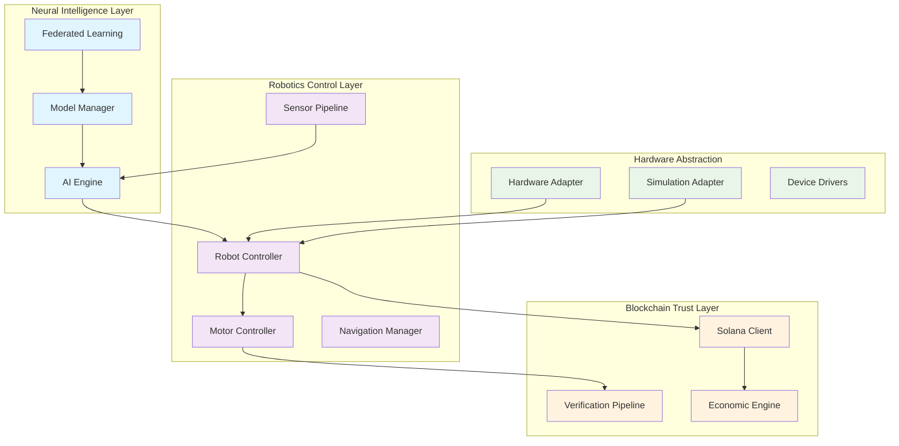

# 📜 SynapseRobo SDK - System Architecture

## 🏗️ System Overview

SynapseRobo employs a **modular microservices architecture** designed for high availability, real-time performance, and cryptographic trust. The system is built around three core pillars interconnected through well-defined APIs and event streams.

### High-Level Architecture Diagram



## 🧩 Core Components Architecture

### 1. Neural Engine Component

```typescript
interface NeuralEngineArchitecture {
  // Core inference pipeline
  inferencePipeline: {
    inputProcessing: 'multi-modal sensor fusion',
    modelExecution: 'tensor computation graph',
    outputValidation: 'safety and constraint checking'
  };
  
  // Learning subsystems
  learningSystems: {
    localTraining: 'on-device reinforcement learning',
    federatedAggregation: 'secure model updates',
    transferLearning: 'cross-domain knowledge transfer'
  };
  
  // Model management
  modelManagement: {
    versionControl: 'model lineage and tracking',
    compression: 'optimization for edge deployment',
    distribution: 'secure model sharing'
  };
}
```

**Key Data Flow:**
```
Sensor Data → Feature Extraction → Neural Inference → Action Planning → Safety Validation
```

### 2. Robot Controller Architecture

```typescript
class RobotControllerArchitecture {
  private kinematicsSolver: InverseKinematicsSolver;
  private motionPlanner: MotionPlanningEngine;
  private safetyMonitor: SafetyEnforcementSystem;
  private hardwareInterface: HardwareAbstractionLayer;
  
  // Real-time control loop
  async controlLoop(desiredState: RobotState): Promise<ControlOutput> {
    const currentState = await this.hardwareInterface.getCurrentState();
    const safeTrajectory = this.motionPlanner.generatePath(currentState, desiredState);
    const jointCommands = this.kinematicsSolver.solve(safeTrajectory);
    
    // Safety validation
    if (!this.safetyMonitor.validate(jointCommands)) {
      return this.emergencyProtocol(safeTrajectory);
    }
    
    return this.hardwareInterface.execute(jointCommands);
  }
}
```

### 3. Solana Trust Layer Architecture

```typescript
interface TrustLayerArchitecture {
  // Transaction management
  transactionPipeline: {
    actionSigning: 'cryptographic proof generation',
    batchProcessing: 'efficient transaction grouping',
    confirmationTracking: 'blockchain state monitoring'
  };
  
  // Smart contract integration
  programInteractions: {
    actionRegistry: 'robot action logging',
    modelSynchronization: 'neural model version control',
    economicCoordination: 'incentive mechanisms'
  };
  
  // Verification systems
  verificationSystems: {
    proofValidation: 'cryptographic proof checking',
    stateConsistency: 'distributed state verification',
    auditTrail: 'immutable action history'
  };
}
```

## 🔄 Data Flow Architecture

### Real-time Control Pipeline

```typescript
class RealTimeDataFlow {
  // High-frequency sensor processing
  async processSensorData(sensors: SensorData[]): Promise<ProcessedData> {
    const fusedData = await this.sensorFusion.fuse(sensors);
    const filteredData = this.kalmanFilter.filter(fusedData);
    const timestampedData = this.timeSync.applyTimestamps(filteredData);
    
    return {
      data: timestampedData,
      confidence: this.calculateConfidence(fusedData),
      latency: this.measureLatency(sensors[0].timestamp)
    };
  }
  
  // AI decision pipeline
  async aiDecisionPipeline(sensorData: ProcessedData): Promise<ActionPlan> {
    const perception = await this.perceptionModule.analyze(sensorData);
    const worldModel = this.worldModel.update(perception);
    const actionPlan = this.planner.generatePlan(worldModel);
    
    // Real-time constraints enforcement
    return this.realTimeEnforcer.constrain(actionPlan, {
      maxComputationTime: 50, // milliseconds
      minimumConfidence: 0.85,
      safetyGuarantees: 'strict'
    });
  }
}
```

### Blockchain Integration Flow

```typescript
class BlockchainIntegrationFlow {
  // Action verification pipeline
  async verifyActionExecution(action: RobotAction): Promise<VerificationResult> {
    // Generate cryptographic proof
    const proof = await this.cryptoEngine.generateProof(action);
    
    // Submit to blockchain
    const transaction = await this.transactionBuilder.build({
      action: action,
      proof: proof,
      robotId: this.identity.getPublicKey(),
      timestamp: Date.now()
    });
    
    // Monitor confirmation
    const confirmation = await this.confirmationTracker.track(transaction.signature);
    
    return {
      verified: confirmation.status === 'confirmed',
      transactionId: transaction.signature,
      blockHeight: confirmation.slot,
      gasUsed: confirmation.computeUnits
    };
  }
}
```

## 🏭 Deployment Architectures

### Single Robot Deployment

```yaml
# docker-compose.single.yml
version: '3.8'
services:
  neural-engine:
    image: synapserobo/neural-engine:2.1
    deploy:
      resources:
        limits:
          memory: 8G
          cpus: '4.0'
    devices:
      - /dev/nvidia0:/dev/nvidia0  # GPU access
    
  robot-controller:
    image: synapserobo/controller:2.1
    privileged: true
    devices:
      - /dev/ttyUSB0:/dev/ttyUSB0  # Serial devices
      - /dev/video0:/dev/video0    # Camera access
    
  trust-layer:
    image: synapserobo/trust-layer:2.1
    environment:
      SOLANA_NETWORK: mainnet-beta
      WALLET_SECRET: ${WALLET_SECRET}
```

### Multi-Robot Fleet Architecture

```typescript
interface FleetArchitecture {
  coordination: {
    leaderElection: 'distributed consensus for coordination',
    taskAllocation: 'optimal resource assignment',
    conflictResolution: 'collision and resource conflict management'
  };
  
  communication: {
    meshNetwork: 'peer-to-peer robot communication',
    blockchainSync: 'distributed state synchronization',
    emergencyBroadcast: 'high-priority message propagation'
  };
  
  scalability: {
    hierarchicalControl: 'regional coordination nodes',
    loadBalancing: 'dynamic task distribution',
    faultTolerance: 'graceful degradation protocols'
  };
}
```

## 🔐 Security Architecture

### Multi-Layer Security Model

```typescript
class SecurityArchitecture {
  // Hardware security
  private hardwareSecurity: {
    secureBoot: 'cryptographic boot verification',
    trustedExecution: 'hardware-enforced code execution',
    tamperDetection: 'physical tamper monitoring'
  };
  
  // Network security
  private networkSecurity: {
    encryptedComms: 'end-to-end encryption',
    certificatePinning: 'trusted node verification',
    intrusionDetection: 'anomaly-based threat detection'
  };
  
  // Application security
  private applicationSecurity: {
    accessControl: 'role-based permission system',
    inputValidation: 'malicious input filtering',
    auditLogging: 'comprehensive security auditing'
  };
  
  // Blockchain security
  private blockchainSecurity: {
    keyManagement: 'hardware-secured key storage',
    transactionSigning: 'cryptographic transaction authorization',
    smartContractAuditing: 'formal verification of on-chain logic'
  };
}
```

## 📊 Performance Architecture

### Real-time Performance Guarantees

```typescript
class PerformanceArchitecture {
  // Latency budgets
  private latencyBudgets: Map<string, number> = new Map([
    ['sensor_processing', 5],    // milliseconds
    ['ai_inference', 35],
    ['control_computation', 10],
    ['actuator_output', 2],
    ['blockchain_commit', 1200]  // Solana confirmation
  ]);
  
  // Resource management
  async manageResources(workload: Workload): Promise<ResourceAllocation> {
    const allocation = this.resourceManager.allocate(workload);
    
    // Enforce real-time constraints
    if (!this.realTimeEnforcer.canMeetDeadlines(allocation)) {
      throw new RealTimeConstraintViolation('Cannot guarantee performance');
    }
    
    return allocation;
  }
  
  // Quality of Service management
  async manageQoS(requirements: QoSRequirements): Promise<QoSPolicy> {
    return this.qosManager.createPolicy(requirements, {
      priority: requirements.criticality,
      redundancy: requirements.reliability,
      monitoring: requirements.observability
    });
  }
}
```

## 🔄 Lifecycle Management

### System Initialization Sequence

```typescript
class SystemInitialization {
  async coldStart(): Promise<SystemState> {
    // Phase 1: Hardware initialization
    await this.hardwareManager.initialize();
    
    // Phase 2: Safety systems activation
    await this.safetyManager.activateEmergencySystems();
    
    // Phase 3: AI model loading
    await this.modelManager.loadModels({
      verification: 'cryptographic_checksum',
      optimization: 'hardware_specific'
    });
    
    // Phase 4: Blockchain connectivity
    await this.blockchainManager.connect();
    
    // Phase 5: Real-time control activation
    return this.controlManager.activateRealTimeLoops();
  }
  
  async gracefulShutdown(): Promise<void> {
    // Phase 1: Stop motion and secure hardware
    await this.controlManager.emergencyStop();
    
    // Phase 2: Persist state and learning progress
    await this.persistenceManager.checkpoint();
    
    // Phase 3: Final blockchain commitments
    await this.blockchainManager.finalizePending();
    
    // Phase 4: Secure hardware shutdown
    await this.hardwareManager.secureShutdown();
  }
}
```

## 🧪 Testing Architecture

### Multi-Level Testing Strategy

```typescript
interface TestingArchitecture {
  unitTesting: {
    componentIsolation: 'individual module testing',
    mockInterfaces: 'hardware and external service simulation',
    coverageRequirements: '95%+ code coverage enforcement'
  };
  
  integrationTesting: {
    subsystemVerification: 'component interaction testing',
    interfaceValidation: 'API and protocol compliance',
    performanceBenchmarking: 'latency and throughput measurement'
  };
  
  systemTesting: {
    endToEndValidation: 'complete system functionality',
    faultInjection: 'resilience and recovery testing',
    securityPenetration: 'vulnerability assessment'
  };
  
  fieldTesting: {
    hardwareInLoop: 'real hardware integration',
    environmentalTesting: 'real-world condition validation',
    longTermReliability: 'extended operation stability'
  };
}
```

## 🌐 Network Architecture

### Distributed Communication Topology

```yaml
# Network configuration for robotic fleet
network_topology:
  control_plane:
    protocol: "gRPC with Protocol Buffers"
    encryption: "TLS 1.3 with mutual authentication"
    discovery: "Distributed hash table (DHT)"
    
  data_plane:
    real_time: "WebRTC data channels"
    bulk_data: "QUIC streams"
    emergency: "Multicast UDP with redundancy"
    
  blockchain_layer:
    primary: "Solana mainnet-beta"
    fallback: "Solana devnet"
    private: "Local validator cluster for testing"
```

## 🔧 Monitoring & Observability

### Comprehensive Telemetry Architecture

```typescript
class ObservabilityArchitecture {
  // Metrics collection
  private metrics: {
    performance: 'latency, throughput, resource usage',
    business: 'mission success, efficiency, cost',
    security: 'threat detection, access patterns, anomalies'
  };
  
  // Distributed tracing
  async traceOperation(operation: string): Promise<TraceContext> {
    return this.tracing.startTrace(operation, {
      samplingRate: this.calculateSamplingRate(operation),
      contextPropagation: 'W3C Trace Context',
      storage: 'time-series database with retention policies'
    });
  }
  
  // Alerting and automation
  private alerting: {
    realTimeAlerts: 'immediate critical condition notification',
    predictiveAlerts: 'machine learning based anomaly prediction',
    automatedResponse: 'self-healing and recovery automation'
  };
}
```

---